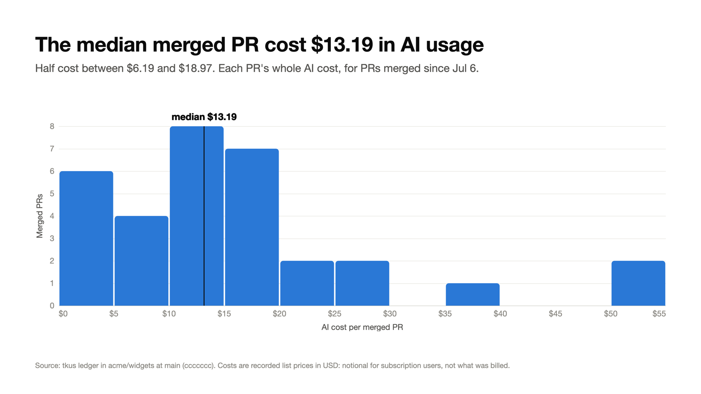

# tkus-vis

What did AI-assisted engineering cost, and what did it ship? tkus-vis turns the spend ledger
that [tkus](https://github.com/natekot/tkus) records in a repository into an executive report
and slide-ready infographics: cost per merged PR, the most expensive PRs, spend against PR
throughput, and where the money went. The readers are directors, not developers.



<sub>Synthetic demo data (`tests/demo_data.py`), not a real repository.</sub>

## How it works

tkus is the collector. Its git hooks price each developer's AI agent usage (Claude Code, GitHub
Copilot CLI) and commit it to `.tkus/<identity>/<branch>.jsonl` inside the repository. tkus-vis
only reads that ledger, from a local clone or through the GitHub API. It writes nothing to the
repositories it analyses and never imports tkus. It depends only on the documented
[ledger format](https://github.com/natekot/tkus#ledger-format).

With `--repo`, each ledger branch is matched to the pull request it became. Every dollar lands
in exactly one bucket: attributed to a PR, committed directly to the default branch, or
unmatched (a deleted or renamed branch, a fork, a detached HEAD).

## Install

Requires Python 3.10 or later. Slide export also needs macOS with Google Chrome installed.

```sh
uv tool install git+https://github.com/natekot/tkus-vis@v0.1.0
```

Releases are listed on the [releases page](https://github.com/natekot/tkus-vis/releases), and
changes in [CHANGELOG.md](CHANGELOG.md).

## Use

```sh
tkus-vis build --path ../my-repo -o out/report.html      # HTML report, plus report.json
tkus-vis slides --path ../my-repo -o out/slides          # 16:9 slides as PNG and PDF
tkus-vis slides --repo OWNER/NAME -o out/slides          # read the ledger and PRs from GitHub
```

`--repo` adds cost per merged PR, the most expensive PRs and coverage to the slides and the
dataset JSON. The HTML report links each branch to its pull request, but doesn't show cost per
PR or coverage yet. Give `--path` too to read the ledger from a local clone while matching PRs
on GitHub. GitHub access is read-only and uses
`GITHUB_TOKEN`, or `gh auth token` when that's unset.

## What the numbers mean

- Costs are each entry's recorded list price, never re-priced. For subscription users they are
  notional, not what was billed.
- Missing data is a coverage gap, not zero cost. Coverage (merged PRs with cost data) is shown
  next to the cost.
- Cost per PR leads with the median and shows the spread, never a mean alone.
- The buckets sum to the ledger total, which reconciles with `tkus rollup --json`. A test
  enforces this.
- Currencies are never summed together.
- Install backlog (`since: null`) stays in totals and out of per-PR figures.

The full rules, and the reasoning behind them, are in the design brief,
[tkus-vis-init.md](tkus-vis-init.md).

## Privacy

Views aggregate by repository. Ledger identities are git display names, and tkus-vis never
emits email addresses. From GitHub it uses PR titles and links only, never diffs or PR bodies.

## Status

Milestones 1 (single repository, reconciled) and 2 (the PR join) are done. Next is organisation
scope: many repositories, and team mapping.

## Development

```sh
uv sync                                    # create .venv with dev tools
uv run pytest                              # all tests
uv run ruff format && uv run ruff check    # before every commit
```

`tests/test_reconcile.py` runs tkus from source as an oracle. It finds tkus at `$TKUS_SRC`
(default `../tkus`) and is skipped when tkus is missing. The slide export tests are skipped
without Google Chrome.

## Contributing

Pull requests are welcome. `main` takes changes through pull requests only. CI must pass, and a
code owner reviews each one. For anything substantial, open an issue first. Please report
security issues privately, as described in [SECURITY.md](SECURITY.md).

## License

[MIT](LICENSE)
